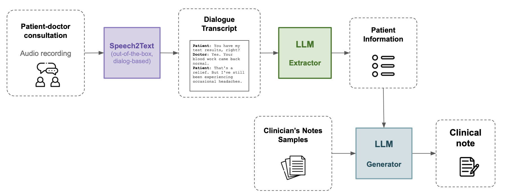

## Automated Clinical Notes

This project is part of the [EPFL MAKE initiative for Generative AI](https://make.epfl.ch/projects/generative-ai). 

Our project aims to automate the process of writing clinical notes. Clinical notes are a summary of the patient-doctor interaction and are generally written by the doctor after the consultation. They are used for billing, communication between doctors, and as a reminder of the patient's history.


Patient-doctor consultations are recorded as audio, which would be converted into a textual transcript by an out-of-the-box dialogue-based Speech-To-Text model, e.g. [Google Cloud API](https://cloud.google.com/speech-to-text/docs/multiple-voices).

We train a Large Language Model (LLM) to generate the clinical note from the dialogue transcript in 2 steps. 

1. **Summarize**: From the dialogue transcript, extract relevant features to create a patient summary, outlining the patient's medical history, current symptoms, and the doctor's diagnosis. 
2. **Generate**: From the patient summary and samples of the clinician's own notes, generate the clinical note.




#### *Meditron*: Base model
For both of these tasks, we will fine-tune [Meditron](https://huggingface.co/epfl-llm/meditron-70b), a version of Llama-2-13B whose pre-training was extended to PubMed articles, abstracts and clinical practice guidelines. **Note**: *Whether we fine-tune two separate versions (one for each task) or a single version for both tasks is still to be determined.*


#### *NoteChat*: Fine-tuning data

For our fine-tuning data, we will use the [NoteChat](https://arxiv.org/abs/2310.15959) dataset [Huggingface link](https://huggingface.co/datasets/akemiH/NoteChat). This dataset contains 167K pairs of real clinical notes extracted from [PMC-Patients](https://arxiv.org/abs/2202.13876) with generated patient-doctor conversations. These pairs are generated using three `GPT-3.5-Turbo` submodules (Planning, Roleplaying and Polishing). The authors show that this approach leads to better dialogue quality than using GPT-4 or ChatGPT alone. 


We extend this dataset of pairs to triplets with GPT-3.5: 

(`clinical note`, `dialogue transcript`) $\to$ (`clinical note`, `dialogue transcript`, `patient summary`)

We extract patient summaries by prompting GPT-3.5 with a clinical note, its corresponding dialogue transcript and a comprehensive template of patient features. 

### Model 1: Summarizer

We fine-tune Meditron on the (`dialogue transcript`, `patient summary`) pairs extracted from NoteChat.


<p align="center">

</p>

### Model 2: Generator

We fine-tune Meditron on the (`patient summary`, `clinical note`) pairs extracted from NoteChat.

<p align="center">

</p>

**Few-shot prompting**: During generation, we may use a few samples of the clinician's own notes to condition the model to the clinician's writing style.


### **Running our code**

First prepare the NoteChat data and generate triplets using:

```bash
python utils/data.py
```

Running inference is done as follows:

```bash
python utils/inference.py \
    --model /path/to/model \
```

Evaluating patient summaries is done as follows:

```bash
python utils/eval.py \
    --mode summary \
    --path data/generated/summaries.jsonl \
    --score_types bleu, rouge, bert
```

Evaluating clinical notes is done as follows:

```bash
python utils/eval.py \
    --mode clinical_note \
    --path data/generated/notes.jsonl \
    --score_types all
```
