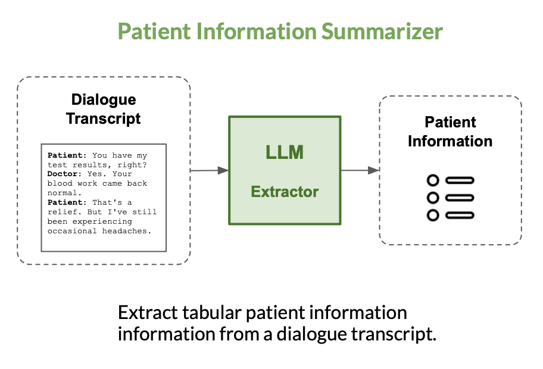

### **MediNote**: Automatic Clinical Note Generation

MediNote is a suite of open-source medical Large Language Models (LLMs) fine-tuned for clinical note generation from the [Meditron](https://arxiv.org/abs/2311.16079) foundation model. 

MediNote-7B and MediNote-13B are trained to generate clinical notes from doctor-patient conversations.


#### *Meditron*: Base model
For both of these tasks, we will fine-tune [Meditron](https://huggingface.co/epfl-llm/meditron-70b), a version of Llama-2-13B whose pre-training was extended to PubMed articles, abstracts and clinical practice guidelines. **Note**: *Whether we fine-tune two separate versions (one for each task) or a single version for both tasks is still to be determined.*


#### *NoteChat*: Fine-tuning data

For our fine-tuning data, we will use the [NoteChat](https://arxiv.org/abs/2310.15959) dataset [Huggingface link](https://huggingface.co/datasets/akemiH/NoteChat). This dataset contains 167K pairs of real clinical notes extracted from [PMC-Patients](https://arxiv.org/abs/2202.13876) with generated patient-doctor conversations. These pairs are generated using three `GPT-3.5-Turbo` submodules (Planning, Roleplaying and Polishing). The authors show that this approach leads to better dialogue quality than using GPT-4 or ChatGPT alone. 


We extend this dataset of pairs to triplets with GPT-3.5: 

(`clinical note`, `dialogue transcript`) $\to$ (`clinical note`, `dialogue transcript`, `patient summary`)

We extract patient summaries by prompting GPT-3.5 with a clinical note, its corresponding dialogue transcript and a comprehensive template of patient features. 

### Model 1: Summarizer

We fine-tune Meditron on the (`dialogue transcript`, `patient summary`) pairs extracted from NoteChat.


<p align="center">

</p>

### Model 2: Generator

We fine-tune Meditron on the (`patient summary`, `clinical note`) pairs extracted from NoteChat.

<p align="center">

</p>

**Few-shot prompting**: During generation, we may use a few samples of the clinician's own notes to condition the model to the clinician's writing style.


### **Running our code**

You can download the [Augmented Clinical Notes](https://huggingface.co/datasets/AGBonnet/augmented-clinical-notes) dataset directly from Huggingface as follows: 

````python
from datasets import load_dataset
dataset = load_dataset("AGBonnet/augmented-clinical-notes")
````

You can load the [MediNote-7B](https://huggingface.co/AGBonnet/medinote-7b) and [MediNote-13B](https://huggingface.co/AGBonnet/medinote-13b) models directly from Huggingface as follows:

````python
from transformers import AutoTokenizer, AutoModelForCausalLM
tokenizer = AutoTokenizer.from_pretrained("AGBonnet/medinote-7b")
model = AutoModelForCausalLM.from_pretrained("AGBonnet/medinote-7b")
````


### **Reproducibility**

To replicate our experiments, you can run our data preprocessing script by first creating the Augmented Clinical Notes dataset as follows: 

```bash
python utils/data.py
```

You can fine-tune MediNote-7B by loading the [Meditron-7B](https://huggingface.co/epfl-llm/meditron-70b) from Huggingface and using the [Megatron-LLM](https://github.com/epfLLM/Megatron-LLM) distributed trainer code. See the documentation for a detailed description of the training procedure. 

Finally, running inference for all evaluated models can be run as follows: 

```bash
./utils/infer.sh all
```

#### **Step 3: Generate clinical notes**

Running inference is done as follows:

```bash
python3 utils/inference.py \
    --model_name meditron-7b-summarizer \
    --model_path /pure-mlo-scratch/make_project/trial-runs/meditron-7b-summarizer/hf_checkpoint/ \
    --input_path /pure-mlo-scratch/make_project/data/inference/summaries_30K.jsonl \
    --output_path /pure-mlo-scratch/make_project/data/inference/generation.jsonl \
    --num_samples 1000 \
    --mode summarizer \
    --template_path /pure-mlo-scratch/make_project/ClinicalNotes/generation/templates/template.json \
```

Alternatively, you can run the full inference for all models using `infer.sh`: 

```bash
./infer.sh
```
Once inference is done, you can evaluate generated patient summaries as follows: 

```bash
python utils/eval.py \
    --mode summary \
    --path data/generated/summaries.jsonl \
    --score_types bleu, rouge, bert
```

Evaluating clinical notes is done as follows:

```bash
python utils/eval.py \
    --mode clinical_note \
    --path data/generated/notes.jsonl \
    --score_types all
```


### Acknowledgments

This project is part of the [EPFL MAKE initiative for Generative AI](https://make.epfl.ch/projects/generative-ai). 
