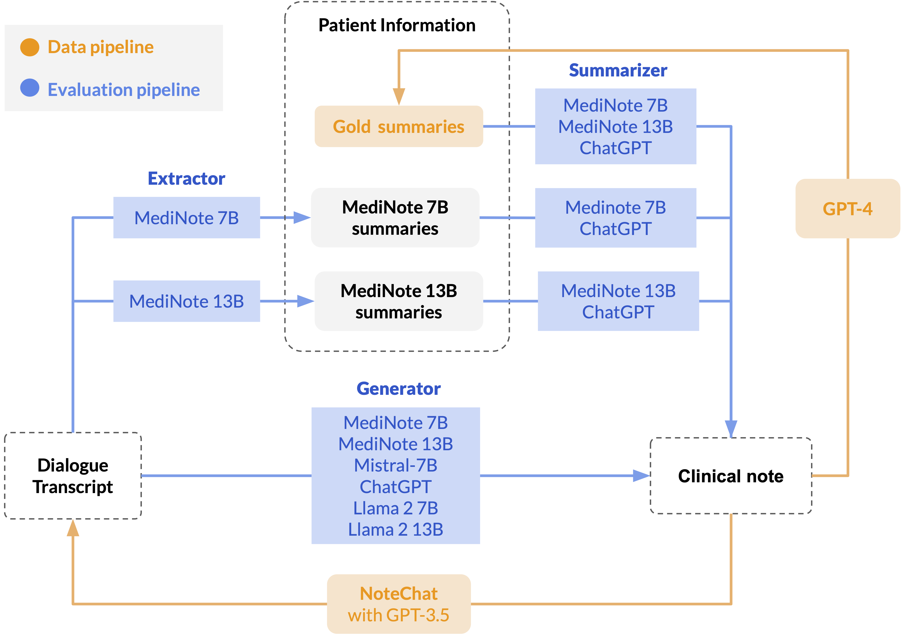

>
MediNote is a suite of open-source medical Large Language Models (LLMs) trained for **clinical note generation**.

[MediNote-7B](https://huggingface.co/AGBonnet/medinote-7b) and [MediNote-13B](https://huggingface.co/AGBonnet/medinote-13b) are fine-tuned from the [Meditron](https://arxiv.org/abs/2311.16079) foundation model to generate clinical notes from doctor-patient conversations.

### Architecture

We fine-tune our models from [MediTron](https://arxiv.org/abs/2311.16079), variants of Llama-2 whose pre-training was extended to PubMed articles, abstracts and clinical practice guidelines. 


####

<p align="center">
     
</p>

### Fine-tuning data

<p align="center">
     
</p>


#### *NoteChat*: Fine-tuning data

For our fine-tuning data, we will use the [NoteChat](https://arxiv.org/abs/2310.15959) dataset [Huggingface link](https://huggingface.co/datasets/akemiH/NoteChat). This dataset contains 167K pairs of real clinical notes extracted from [PMC-Patients](https://arxiv.org/abs/2202.13876) with generated patient-doctor conversations. 


### **Write your own clinical notes**

You can use our [MediNote-7B](https://huggingface.co/AGBonnet/medinote-7b) and [MediNote-13B](https://huggingface.co/AGBonnet/medinote-13b) generator models to writes notes directly from patient-doctor conversations.

You can load either model directly from Huggingface to a chosen path as follows:

````python
# Load model and tokenizer
from transformers import AutoTokenizer, AutoModelForCausalLM
tokenizer = AutoTokenizer.from_pretrained("AGBonnet/medinote-7b")
model = AutoModelForCausalLM.from_pretrained("AGBonnet/medinote-7b"

# Save to local directory
model_path = "model/medinote-13b"
tokenizer.save_pretrained(model_path)
model.save_pretrained(model_path)
````

Note that dialogues be formatted as follows:

```
Doctor: Hello, how are you doing today?
Patient: Not so well! I have a headache.
```

You can then generate your own note with `utils/infer.py` (which uses [vLLM](https://github.com/vllm-project/vllm)):

```bash
./utils/infer.sh \
    --model_path model/medinote-7b \
    --dialogue "Doctor: Hello, how are you doing today?\nPatient: Not so well! I have a headache."
```

### **Reproducibility**

To replicate our experiments, you can run our data preprocessing script by first creating the Augmented Clinical Notes dataset as follows: 

```bash
python utils/data.py
```

Alternatively, you can directly download the [Augmented Clinical Notes](https://huggingface.co/datasets/AGBonnet/augmented-clinical-notes) dataset directly from Huggingface as follows: 

````python
from datasets import load_dataset
dataset = load_dataset("AGBonnet/augmented-clinical-notes")
``````

You can fine-tune your own MediNote-7B by loading the [MediTron-7B](https://huggingface.co/epfl-llm/meditron-70b) from Huggingface and using the [Megatron-LLM](https://github.com/epfLLM/Megatron-LLM) distributed trainer code. Note that the MediTron-13B we used as base for MediNote-13B is not publicly available. See the documentation for a detailed description of the training procedure. 

<p align="center">
     
</p>

Finally, you can run the full inference for all models shown above using `infer.sh`: 

```bash
./utils/infer.sh all
```


Once inference is done, you can evaluate generated patient summaries using the `eval.ipynb` notebook.

### Supplementary material

Here is the template we used to generate patient summaries from the NoteChat dataset (available in JSON format in `generation/templates/template_definitions.json`)
<p align="center">
     
</p>

Here are the prompts used for training and inference:
<p align="center">
     
</p>

### Acknowledgments

This project is a contribution to the [2023 MAKE Initiative for Generative AI](https://make.epfl.ch/projects/generative-ai) at the Swiss Federal Institute of Technology (EPFL). This project was initiated and funded by Prof. Antoine Bosselut of NLP lab and Prof Martin Jaggi of MLO lab. 
We also thank Alexandre Sallinen for his advice on chaining specialized LLMs and Prof. Mary-Anne Hartley for her advice on the appropriate template for medical patient summaries. 

### Citation

If you use this code or our models, please cite the following paper:

```
ADD PAPER
```